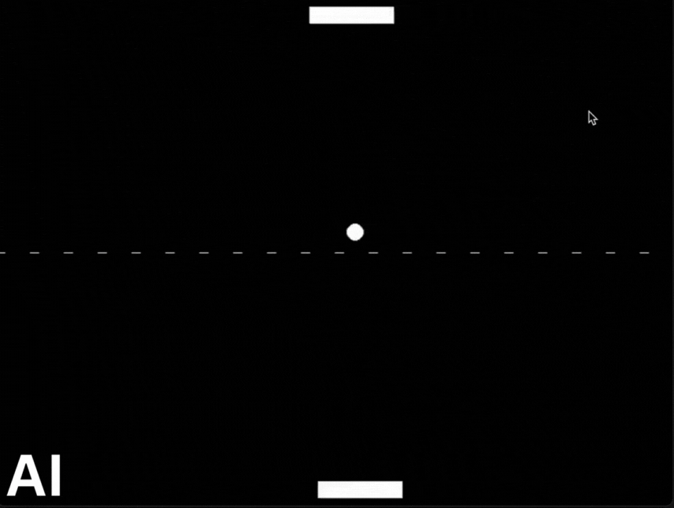
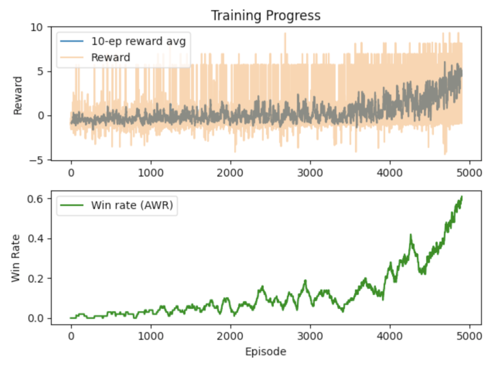

# Pong Reinforcement Learning Agent

Train a simple reinforcement learning agent to play Pong using a low-dimensional state space.

## 🧍‍♂️ The Opponent
- Uses a deterministic heuristic to move the paddle.
- Always aligns its paddle with the x-position of the ball, making it a near-perfect reflex agent (no reaction delay or error margin).
- This creates a challenging baseline — the agent must learn to exploit ball dynamics and angles to win points.

## 🧠 State Representation
- Ball position `(x, y)`
- Ball velocity `(vx, vy)`
- Paddle 1 (agent) position
- Paddle 2 (opponent) position
- Distance to ball

In total, a 7D Vector fed into the DQN as input for predicting action values.

## 🎮 Actions
- Move paddle **up**
- Move paddle **down**
- **Do nothing**

## 🎯 Rewards
- `+10` when the agent scores
- `-5` when the opponent scores
- `+1` for hitting the ball
- `+0.01` for every live frame
- `+0.05 * (1 - (distance/max_distance))` to incentivise lining up the paddle with the ball
  
It's quite complicated and not ideal, but it yields useful results in the long run.

## 🔁 Training Loop
At each timestep:
1. Agent observes state
2. Picks an action
3. Environment updates
4. Agent receives reward

## 📈 Results
- After training for 5,000 episodes, the agent achieves a **>60% win rate** against the rule-based opponent.
- Demonstrates the agent's ability to learn effective strategies and outperform a strong baseline.

### 🎮 Gameplay Example

### 📊 Training Statistics

Q-learning in motion: reward shaping and policy refinement over time.

## 📦 Dependencies
- Python 3.x
- Pygame (for rendering, optional)
- PyTorch
- Matplotlib
